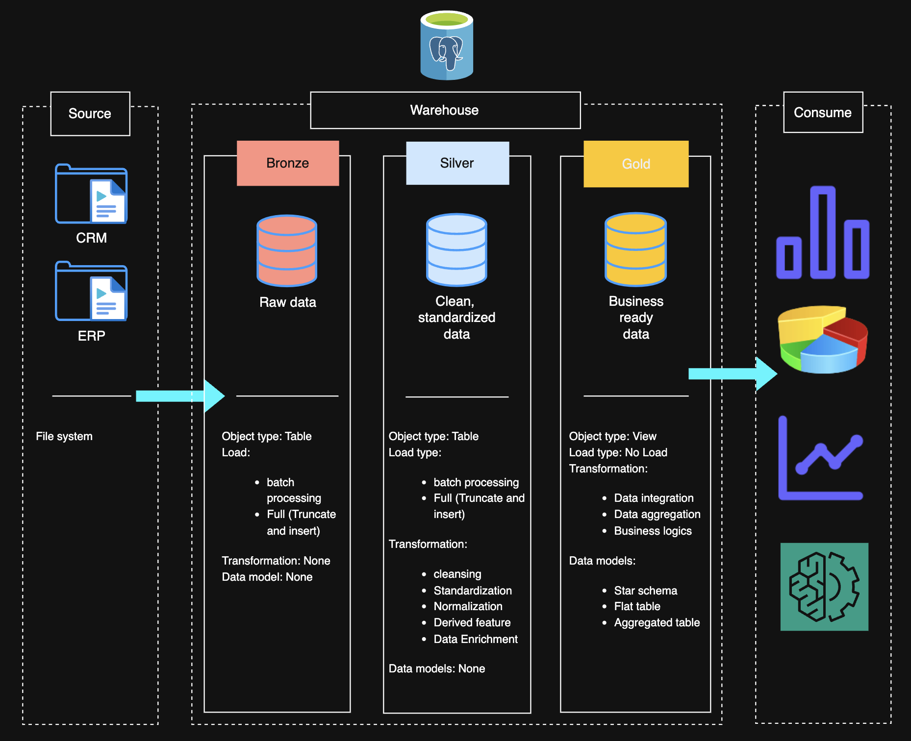

# Data Warehouse and Analytics Project

Welcome to the **Data Warehouse and Analytics Project** repository! 🚀  
This project demonstrates a comprehensive data warehousing and analytics solution, from building a data warehouse to generating actionable insights. Designed as a portfolio project, it highlights industry best practices in data engineering and analytics.

---
## 🏗️ Data Architecture

The data architecture for this project follows Medallion Architecture **Bronze**, **Silver**, and **Gold** layers:

1. **Bronze Layer**: Stores raw data as-is from the source systems. Data is ingested from CSV Files into SQL Server Database.
2. **Silver Layer**: This layer includes data cleansing, standardization, and normalization processes to prepare data for analysis.
3. **Gold Layer**: Houses business-ready data modeled into a star schema required for reporting and analytics.

---
## 📖 Project Overview

This project involves:

1. **Data Architecture**: Designing a Modern Data Warehouse Using Medallion Architecture **Bronze**, **Silver**, and **Gold** layers.
2. **ETL Pipelines**: Extracting, transforming, and loading data from source systems into the warehouse.
3. **Data Modeling**: Developing fact and dimension tables optimized for analytical queries.
4. **Analytics & Reporting**: Creating SQL-based reports and dashboards for actionable insights.

🎯 This repository is an excellent resource for professionals and students looking to showcase expertise in:
- SQL Development
- Data Architect
- Data Engineering  
- ETL Pipeline Developer  
- Data Modeling  
- Data Analytics  

---

## 🚀 Project Requirements

### Building the Data Warehouse (Data Engineering)

#### Objective
Develop a modern data warehouse using SQL Server to consolidate sales data, enabling analytical reporting and informed decision-making.

#### Specifications
- **Data Sources**: Import data from two source systems (ERP and CRM) provided as CSV files.
- **Data Quality**: Cleanse and resolve data quality issues prior to analysis.
- **Integration**: Combine both sources into a single, user-friendly data model designed for analytical queries.
- **Scope**: Focus on the latest dataset only; historization of data is not required.
- **Documentation**: Provide clear documentation of the data model to support both business stakeholders and analytics teams.

---

### BI: Analytics & Reporting (Data Analysis)

#### Objective
Develop SQL-based analytics to deliver detailed insights into:
- **Customer Behavior**
- **Product Performance**
- **Sales Trends**

These insights empower stakeholders with key business metrics, enabling strategic decision-making.  

___

## ⚙️ Setup Instructions

Follow these steps to set up the data warehouse project in PostgreSQL:

1. **Create a PostgreSQL database manually**
   Use your preferred method (GUI or terminal) to create a new PostgreSQL database.

2. **Run `scripts/setup_schema.sql`**
   This script will create all necessary schemas (`bronze`, `silver`, and `gold`) in the database.

3. **Run `scripts/bronze/ddl_bronze.sql`**
   This will create the staging tables inside the `bronze` schema where raw CSV data will be ingested.

4. **Modify `scripts/bronze/proc_load_bronze.sql`**
   Open this file and change the CSV file paths in the `COPY ... FROM` commands to point to the correct file locations on your system.
   If PostgreSQL is unable to access the files from your current location, move the `datasets` folder to:

   * `/tmp` directory on **Mac**, or
   * `C://TEMP` directory on **Windows**

   Then update the paths in the script to reflect this new location. After editing, run this script. It will create a stored procedure named `bronze.load_bronze`, which can be reused to load data from CSV files into the `bronze` layer.

   At this point, the Bronze layer data staging is complete.

5. **Run `scripts/silver/ddl_silver.sql`**
   This script creates the transformed and cleaned tables in the `silver` schema.

6. **Run `scripts/silver/proc_load_silver.sql`**
   This creates a stored procedure named `silver.load_silver`, which will be reused to load transformed data into the `silver` layer tables.

7. **Run `scripts/gold/ddl_gold.sql`**
   This script creates views in the `gold` schema representing business-ready, analysis-friendly data. These views are reusable for reporting and analytics.

---

## 🛡️ License

This project is licensed under the [MIT License](LICENSE). You are free to use, modify, and share this project with proper attribution.

## 🌟 About Me

Hi there! I'm Sagar. I’m a software engineer professional and exploring deep into the field of data science, data analytics, deep learning. Looking forward to solve real world data problems by creating streamlined solutions.

Let's stay in touch! Feel free to connect with me on the following platforms:

